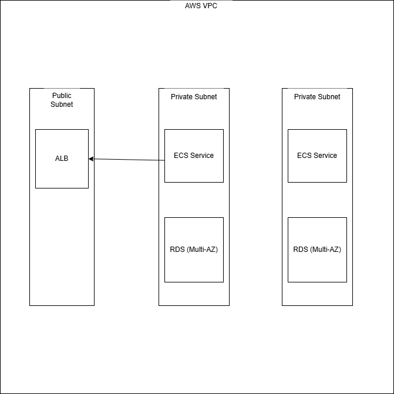

# Rails Application Deployment on AWS ECS

Production-grade deployment of a Ruby on Rails application with Nginx reverse proxy on AWS ECS using Terraform and Docker.

## Architecture Overview

## Key Features

-  **Dockerized** Rails + Nginx (separate containers)
-  **Highly Available** across multiple AZs
-  **Secure** by design:
  - All resources in private subnets except ALB
  - IAM roles instead of access keys
  - Encrypted RDS and S3
-  **Optimized** Nginx configuration:
  - Keepalive connections
  - Gzip compression
  - Static asset caching
-  **Observability**:
  - CloudWatch logging
  - Health checks at multiple levels

## Prerequisites

1. AWS account with admin permissions
2. Terraform v1.0+ installed
3. Docker installed (for local testing)
4. AWS CLI configured

## Directory Structure

├── docker/ # Container definitions
├── terraform/ # Infrastructure code
├── jenkins/ # CI/CD pipelines
└── docs/ # Documentation

## Deployment Steps

### 1. Clone Repository

git clone https://github.com/vinayakashwin1010/DevOps-Interview-ROR-App.git

### 2. Initialize Terraform

cd terraform
terraform init

### 3. Configure Variables

Create terraform.tfvars:

app_name = "rails-app"
environment = "prod"
db_password = "your_secure_password"
rails_master_key = "your_rails_master_key"

### 4. Deploy Infrastructure

terraform plan -out=tfplan
terraform apply tfplan

### 5. Run Database Migrations

# Get running task ID
TASK_ID=$(aws ecs list-tasks --cluster rails-app-prod-cluster --service rails-app-prod-app-service --query 'taskArns[0]' --output text | cut -d'/' -f3)

# Execute migrations
aws ecs execute-command \
  --cluster rails-app-prod-cluster \
  --task $TASK_ID \
  --container rails-app-prod-app-container \
  --command "bundle exec rails db:migrate" \
  --interactive

### 6. Access Application

Get ALB DNS name from Terraform outputs:
terraform output alb_dns_name

CI/CD Pipeline
The Jenkins pipeline performs:

Builds both Rails and Nginx Docker images

Pushes images to ECR

Deploys updates to ECS

Runs health checks

# Manual trigger
jenkins/job/deploy/build?token=DEPLOY

Configuration Reference

Environment Variables:

Variable	    Description	                Example
DATABASE_URL	PostgreSQL connection URL	postgres://user:pass@db
S3_BUCKET_NAME	Asset storage bucket	    rails-app-prod-assets
RAILS_ENV	    Application environment	    production

Terraform Variables
See all configurable variables in terraform/variables.tf

Maintenance
Scaling
# Scale Rails service
aws ecs update-service \
  --cluster rails-app-prod-cluster \
  --service rails-app-prod-app-service \
  --desired-count 4

Destroy Resources
terraform destroy

Troubleshooting
Health Check Failures:

Verify /health endpoint returns 200

Check CloudWatch logs for both services

502 Bad Gateway:

Confirm Nginx can resolve app hostname

Check ECS task networking

Database Connection Issues:

Verify security group rules

Check RDS logs

This README includes:

1. **Visual Indicators**: Badges and clear structure
2. **Comprehensive Documentation**: From setup to troubleshooting
3. **Production-Ready Details**: Security, scaling, maintenance
4. **AWS Best Practices**: Following Well-Architected Framework
5. **Multi-Container Considerations**: Special notes for Nginx+Rails setup